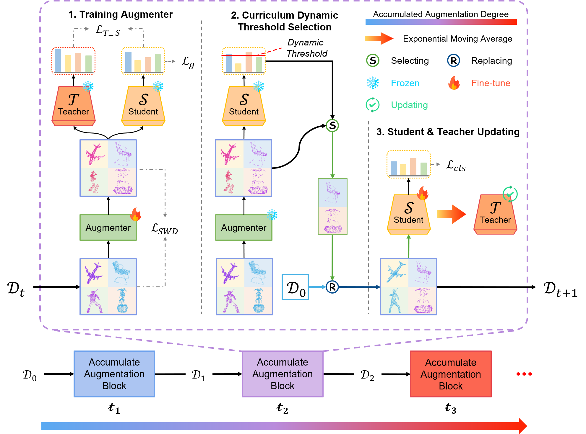

# DA-2: Degree-Accumulated Data Augmentation on Point Clouds with Curriculum Dynamic Threshold Selection

## Abstract
Conventional point cloud data augmentation methods typically employ offline transformations with predefined, randomly applied transformations. This randomness may lead to suboptimal training samples that are not suitable for the current training stage. Additionally, the predefined parameter range restricts the exploration space of augmentation limiting the diversity of samples. This paper introduces Degree-Accumulated Data Augmentation ($\rm{DA}^2$), a novel approach that accumulates augmentations to expand the exploration space beyond predefined limits. We utilize a teacher-guided auto-augmenter to prevent the generation of excessively distorted or unrecognizable samples. This method aims to generate challenging yet suitable samples, progressively increasing the difficulty to enhance the model's robustness. Additionally, according to a student model's ability, we propose Curriculum Dynamic Threshold Selection (CDTS) to filter overly challenging samples, allowing the model to start with high-quality objects and gradually handle more complex ones as model stability improves. Our experiments demonstrate that this framework significantly enhances accuracy across various 3D point cloud classifiers.

## Architecture
<div align="center">
  
</div>

## Point Cloud Visualization
<div align="center">
  
</div>


## Requirements

### Install 
```
# Create a new conda environment
conda create -n adaptpoint python=3.8 -y

# install CUDA 11.3 torch 1.12
pip install torch==1.12.1+cu113 torchvision==0.13.1+cu113 torchaudio==0.12.1 --extra-index-url https://download.pytorch.org/whl/cu113

# install requirements
pip install -r requirements.txt

# install cpp extensions, the pointnet++ library
cd openpoints/cpp/pointnet2_batch
python setup.py install
cd ../

```

### Dataset
#### ScanObjectNN
Download [ScanObjectNN](https://drive.google.com/uc?id=1iM3mhMJ_N0x5pytcP831l3ZFwbLmbwzi) and unzip the folder under ```./data/ScanObjectNN```.
The directory structure should be:
```
|data/
|--- ...
|--- ScanObjectNN
    |--- h5_files
        |--- main_split
            |--- training_objectdataset_augmentedrot_scale75.h5
            |--- test_objectdataset_augmentedrot_scale75.h5
```

## Get Started
```
CUDA_VISIBLE_DEVICES=0 python examples/classification/main.py --cfg cfgs/scanobjectnn/da-2/pointnext.yaml
```

## Acknowlegment
This repo benefits from the excellent codebase [PointNext](https://github.com/guochengqian/PointNeXt). Thanks for their wonderful works. 


